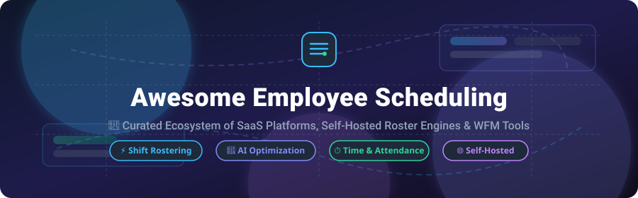

<p align="center">
  
</p>

<p align="center">
  <a href="https://github.com/ishandutta2007/Awesome-Awesome-Awesome"></a>
  <a href="https://discord.gg/jc4xtF58Ve"></a>
  <a href="https://github.com/ishandutta2007/Awesome-Employee-Scheduling/stargazers"></a>
  <a href="https://github.com/ishandutta2007/Awesome-Employee-Scheduling/network/members"></a>
  <a href="https://github.com/ishandutta2007/Awesome-Employee-Scheduling/blob/main/LICENSE"></a>
  <a href="https://github.com/ishandutta2007"></a>
</p>

---

# 📅 Awesome Employee Scheduling & Workforce Management

> 🚀 **Curated Ecosystem of SaaS Platforms, Self-Hosted Roster Engines, Open-Source Workforce Management (WFM) Software & Scheduling UI Libraries**

Welcome to **Awesome Employee Scheduling**, the definitive technical guide and reference catalog for **staff rostering, shift scheduling, automated shift swapping, time and attendance tracking, and constraint-based workforce optimization**.

Whether you are evaluating commercial **workforce management SaaS platforms** (like *Deputy*, *When I Work*, *Homebase*, *Sling*, *Connecteam*, or *Planday*), building a **self-hosted employee scheduling system**, or integrating **AI-driven constraint solvers** (*Timefold*, *Google OR-Tools*, *OptaPlanner*), this repository provides actionable mapping and open-source building blocks.

---

## 📑 Table of Contents

- [📊 Market Overview & Industry Structure](#-market-overview--industry-structure)
- [💼 Commercial SaaS Platforms](#-commercial-saas-platforms)
- [⚡ Open-Source GitHub Projects](#-open-source-github-projects)
  - [🖥️ Complete Employee Scheduling Applications](#️-complete-employee-scheduling-applications)
  - [🏢 HR & ERP Platforms with Scheduling Capabilities](#-hr--erp-platforms-with-scheduling-capabilities)
  - [🧠 Scheduling & Constraint Optimization Engines](#-scheduling--constraint-optimization-engines)
  - [📅 Calendar & Scheduling UI Components](#-calendar--scheduling-ui-components)
  - [⏱️ Time & Attendance Building Blocks](#️-time--attendance-building-blocks)
  - [🛠️ Infrastructure, Analytics & Workflow Automation](#️-infrastructure-analytics--workflow-automation)
- [🗺️ Commercial → Open-Source Capability Mapping](#️-commercial--open-source-capability-mapping)
- [🏗️ Self-Hosted Workforce Platform Architecture](#️-self-hosted-workforce-platform-architecture)
- [📈 Star History](#-star-history)
- [💖 Support & Contributing](#-support--contributing)

---

## 📊 Market Overview & Industry Structure

> 💡 **Market Size & Dynamics:** The global **Employee Scheduling & Workforce Management (WFM) Software Market** is estimated at **$4.8 Billion (2025/2026)** and is projected to expand to **$9.2 Billion by 2030** at a CAGR of **~11.5%**. The market is **highly fragmented**, featuring specialized SMB hourly workforce tools (*Homebase*, *When I Work*, *Sling*), mid-market/enterprise suites (*Deputy*, *Planday*, *Connecteam*), vertical-specific rostering platforms (*7shifts* for restaurants, *Rotaready* for hospitality), and ERP-embedded HR platforms (*Odoo*, *BambooHR*, *ERPNext*), rather than a single winner-take-all monopoly.

---

## 💼 Commercial SaaS Platforms

The table below catalogs top commercial **Employee Scheduling & Workforce Management** platforms, sorted by **Company Valuation / Revenue / Size (Descending)**:

| Platform | Company Valuation / Revenue / Size | Starting Pricing | Free Tier / Trial Limits | Primary Scheduling Capabilities |
| :--- | :--- | :--- | :--- | :--- |
| **[Toast (Sling)](https://getsling.com/)** | ~$15.0B+ Valuation / $3.8B+ Rev | $2.00 / user / month | Free Plan available (Shift scheduling & newsfeed for unlimited users) | Shift scheduling, availability, open shift management, messaging, labor cost controls. |
| **[Xero (Planday)](https://www.planday.com/)** | ~$12.0B+ Valuation / $1.2B+ Rev | $3.30 (€3.00) / user / month | 30-day free trial (Full platform features included) | Rota planning, shift templates, open shifts, availability, time tracking, payroll sync. |
| **[BambooHR](https://www.bamboohr.com/)** | ~$1.5B+ Valuation / $200M+ ARR | $5.25 / user / month | 7-day free trial (Full HR platform sandbox access) | Core HR data, employee directory, time-off requests, workforce shift administration. |
| **[Deputy](https://www.deputy.com/)** | ~$1.1B Valuation / $100M+ ARR | $4.50 / user / month | 31-day free trial (No credit card required) | Auto-scheduling, demand forecasting, shift swapping, compliance, meal break tracking. |
| **[Factorial](https://factorialhr.com/)** | ~$1.0B Valuation / $200M+ Raised | $6.60 (€6.00) / user / month | 14-day free trial (Up to 50 employees during trial) | Shift planning, attendance tracking, leave management, HR workflows. |
| **[Connecteam](https://connecteam.com/)** | ~$800M Valuation / $160M Raised | $29.00 / month (Up to 30 users) | Free Small Business Plan (Free forever for up to 10 users) | Employee scheduling, shift dispatch, geo-fenced clock-in, team chat, task management. |
| **[Homebase](https://www.joinhomebase.com/)** | ~$500M Valuation / $50M ARR | $20.00 / location / month | Basic Free Plan (Free forever for 1 location & up to 20 staff) | Drag-and-drop schedule building, availability, shift trades, time clock, labor cost tracking. |
| **[Humanity & TimeClock Plus](https://tcpsoftware.com/products/humanity/)** | ~$400M Valuation / $100M+ Rev | $3.00 / user / month ($30 min/mo) | 30-day free trial (Full automated scheduling access) | AI-driven auto-scheduling, demand forecasting, compliance rules, self-service shift swaps. |
| **[When I Work](https://wheniwork.com/)** | ~$200M Valuation / $50M+ ARR | $2.50 / user / month | 14-day free trial (Up to 75 employees during trial) | Hourly worker scheduling, employee availability, team chat, shift replacement alerts. |
| **[7shifts](https://www.7shifts.com/)** | ~$180M Valuation / $30M ARR | $29.99 / location / month | Free Plan (Free forever for 1 location & up to 30 staff) | Restaurant employee scheduling, tip pooling, labor compliance, shift bidding. |
| **[Quinyx](https://www.quinyx.com/)** | ~$150M Valuation / $100M+ Raised | $5.00 / user / month | 14-day free trial / interactive demo | Enterprise workforce management, AI demand forecasting, labor optimization. |
| **[Workforce.com](https://www.workforce.com/)** | ~$120M Valuation / $50M ARR | $4.00 / user / month | 14-day free trial (Full administrative access) | Intelligent auto-rostering, fatigue monitoring, labor compliance, real-time variance. |
| **[Skello](https://www.skello.io/)** | ~$60M Valuation / €40M Raised | $3.90 (€3.50) / user / month | 14-day free trial (Full roster management features) | Smart shift planning, absence tracking, collective agreement rules, payroll export. |
| **[Papershift](https://www.papershift.com/)** | ~$25M Valuation / $10M ARR | $5.50 (€5.00) / user / month | 14-day free trial (Full roster & time tracking access) | Rota creator, working hour accounts, absence management, shift assignment. |
| **[ZoomShift](https://www.zoomshift.com/)** | ~$15M Valuation / $5M ARR | $2.50 / user / month | 14-day free trial (Up to 100 staff members) | Hourly worker scheduling, shift swap requests, push notifications, web time clock. |
| **[ScheduleAnywhere](https://www.scheduleanywhere.com/)** | ~$15M Valuation | $25.00 / month (Up to 25 staff) | 30-day free trial (Multi-department access) | Recurring shift schedules, multi-department rostering, skill tracking, self-scheduling. |
| **[Shyft](https://www.myshyft.com/)** | ~$12M Valuation | $2.00 / user / month | 14-day free trial (Shift swapping & chat access) | Peer-to-peer shift swapping, shift marketplace, team messaging, open shift claiming. |
| **[Findmyshift](https://www.findmyshift.com/)** | ~$10M Valuation / $3M ARR | $25.00 / schedule / month | Free Plan (Free forever for up to 5 staff & 1 manager) | Spreadsheet-style schedule builder, drag-and-drop shifts, labor cost calculation. |
| **[RotaCloud](https://rotacloud.com/)** | ~$10M Valuation / $3M ARR | $2.60 (£2.00) / user / month | 14-day free trial (Unlimited employees) | Rota management, leave management, employee availability, shift pattern templates. |
| **[Rotaready](https://rotaready.co.uk/)** | ~$8M Valuation | $3.30 (£2.50) / user / month | 14-day free trial (Hospitality setup) | Hospitality workforce scheduling, automated shift allocation, wage monitoring. |
| **[Smartplan](https://smartplanapp.io/)** | ~$5M Valuation | $32.00 (€29.00) / month | 14-day free trial (Up to 15 employees included) | Online shift planner, shift trading, time tracking, mobile app notifications. |
| **[TimeTrex Cloud](https://www.timetrex.com/)** | ~$5M Valuation | $3.00 / user / month | Community Edition is 100% Free Self-Hosted | Automated shift scheduling, job costing, time clocking, integrated payroll. |

---

## ⚡ Open-Source GitHub Projects

Below are open-source repositories and components for building self-hosted employee scheduling platforms, sorted within each category by **GitHub Stars (Descending)**.

### 🖥️ Complete Employee Scheduling Applications

- **[Staffjoy V2](https://github.com/Staffjoy/v2)** [](https://github.com/Staffjoy/v2/stargazers) — Microservice-based workforce management app designed for small business shift scheduling and staff administration.
- **[OpenSkedge](https://github.com/OfficeStack/OpenSkedge)** [](https://github.com/OfficeStack/OpenSkedge/stargazers) — Flexible web-based employee scheduling application built for companies and organizations with fluid shift structures.
- **[Employee Shift Scheduler](https://github.com/SirChri/employee-shift-scheduler)** [](https://github.com/SirChri/employee-shift-scheduler/stargazers) — Full-stack employee shift scheduler built with React, Java Spring Boot, and PostgreSQL.
- **[Employee Scheduling](https://github.com/martinmicunda/employee-scheduling)** [](https://github.com/martinmicunda/employee-scheduling/stargazers) — Mobile-friendly employee scheduling and staff management web application.
- **[Shift Scheduler (oasido)](https://github.com/oasido/shift-scheduler)** [](https://github.com/oasido/shift-scheduler/stargazers) — Web application for employee shift scheduling and absence-request management with Docker containerization.
- **[Scheduler](https://github.com/averude/Scheduler)** [](https://github.com/averude/Scheduler/stargazers) — Open-source employee rostering and work-scheduling web service supporting automated timetable generation.
- **[Schichtplaner](https://github.com/lennystepn-hue/schichtplaner)** [](https://github.com/lennystepn-hue/schichtplaner/stargazers) — Self-hosted shift-planning tool with availability preferences, schedule optimization, and real-time collaboration.
- **[Shift Scheduler (robol)](https://github.com/robol/shift-scheduler)** [](https://github.com/robol/shift-scheduler/stargazers) — Employee shift scheduler using integer optimization to balance worker preferences with organizational rules.
- **[ShiftWizard](https://github.com/NaphtaliO/ShiftWizard)** [](https://github.com/NaphtaliO/ShiftWizard/stargazers) — Self-hosted employee rostering system with separate employer and employee portals.
- **[Employee Scheduling System](https://github.com/mperry-dev/employee_scheduling_system)** [](https://github.com/mperry-dev/employee_scheduling_system/stargazers) — Automated employee assignment tool using OptaPlanner for shift allocation and constraint matching.

---

### 🏢 HR & ERP Platforms with Scheduling Capabilities

- **[Odoo Community](https://github.com/odoo/odoo)** [](https://github.com/odoo/odoo/stargazers) — Open-source ERP suite featuring modular HR, employee management, planning, time-off, and attendance capabilities.
- **[ERPNext](https://github.com/frappe/erpnext)** [](https://github.com/frappe/erpnext/stargazers) — Comprehensive ERP platform with employee records, shift management, attendance tracking, leave, and payroll.
- **[Frappe HR](https://github.com/frappe/hrms)** [](https://github.com/frappe/hrms/stargazers) — Dedicated open-source HR and workforce management system built on the Frappe framework.
- **[OrangeHRM](https://github.com/orangehrm/orangehrm)** [](https://github.com/orangehrm/orangehrm/stargazers) — Popular open-source HR platform covering employee directory, leave management, attendance, and performance.
- **[TimeTrex Community](https://github.com/timetrex/timetrex)** [](https://github.com/timetrex/timetrex/stargazers) — Self-hosted workforce management system covering employee scheduling, time clocking, and payroll.

---

### 🧠 Scheduling & Constraint Optimization Engines

- **[Google OR-Tools](https://github.com/google/or-tools)** [](https://github.com/google/or-tools/stargazers) — Fast optimization engine supporting mixed-integer programming and constraint solver models for automated workforce scheduling.
- **[Pyomo](https://github.com/Pyomo/pyomo)** [](https://github.com/Pyomo/pyomo/stargazers) — Python-based mathematical modeling framework for formulating complex workforce rostering and labor-cost optimization problems.
- **[PuLP](https://github.com/coin-or/pulp)** [](https://github.com/coin-or/pulp/stargazers) — Linear programming modeler in Python for solving shift coverage, employee assignment, and staffing models.
- **[Timefold Solver](https://github.com/TimefoldAI/timefold-solver)** [](https://github.com/TimefoldAI/timefold-solver/stargazers) — Open-source AI constraint solver for planning and shift scheduling with complex availability and fairness rules.
- **[SCIP](https://github.com/scipopt/scip)** [](https://github.com/scipopt/scip/stargazers) — High-performance solver suite for mixed-integer programming and constraint integer programming.
- **[Timefold Quickstarts](https://github.com/TimefoldAI/timefold-quickstarts)** [](https://github.com/TimefoldAI/timefold-quickstarts/stargazers) — Production-ready optimization templates including employee rostering and shift allocation.
- **[OptaPlanner](https://github.com/kiegroup/optaplanner)** [](https://github.com/kiegroup/optaplanner/stargazers) — Java constraint-solving engine for workforce planning, roster generation, and resource management.
- **[OptaPlanner Quickstarts](https://github.com/kiegroup/optaplanner-quickstarts)** [](https://github.com/kiegroup/optaplanner-quickstarts/stargazers) — Practical code samples for shift allocation based on employee skills and availability.
- **[pyworkforce](https://github.com/rodrigo-arenas/pyworkforce)** [](https://github.com/rodrigo-arenas/pyworkforce/stargazers) — Python tools for workforce management, queuing, scheduling, Erlang calculations, and rostering optimization.

---

### 📅 Calendar & Scheduling UI Components

- **[Cal.com](https://github.com/calcom/cal.com)** [](https://github.com/calcom/cal.com/stargazers) — Open-source scheduling infrastructure and booking platform.
- **[FullCalendar](https://github.com/fullcalendar/fullcalendar)** [](https://github.com/fullcalendar/fullcalendar/stargazers) — Popular JavaScript calendar library for building interactive drag-and-drop employee shift timelines.
- **[TOAST UI Calendar](https://github.com/nhn/tui.calendar)** [](https://github.com/nhn/tui.calendar/stargazers) — Full-featured JavaScript grid calendar component for schedule visualization.
- **[React Big Calendar](https://github.com/jquense/react-big-calendar)** [](https://github.com/jquense/react-big-calendar/stargazers) — Flexbox-based React event calendar for shift roster management.
- **[rrule](https://github.com/jakubroztocil/rrule)** [](https://github.com/jakubroztocil/rrule/stargazers) — Recurrence-rule library for working with recurring shifts and schedule patterns in JS/TS.
- **[Schedule-X](https://github.com/schedule-x/schedule-x)** [](https://github.com/schedule-x/schedule-x/stargazers) — Modern, accessible JavaScript event calendar and shift scheduler component.

---

### ⏱️ Time & Attendance Building Blocks

- **[Kimai](https://github.com/kimai/kimai)** [](https://github.com/kimai/kimai/stargazers) — Open-source time tracking application ideal for logging worked hours alongside scheduling software.
- **[Nextcloud Calendar](https://github.com/nextcloud/calendar)** [](https://github.com/nextcloud/calendar/stargazers) — CalDAV calendar app providing employee availability sync and schedule sharing.

---

### 🛠️ Infrastructure, Analytics & Workflow Automation

- **[n8n](https://github.com/n8n-io/n8n)** [](https://github.com/n8n-io/n8n/stargazers) — Workflow automation platform for connecting shift schedules with payroll, messaging, and HR software.
- **[Grafana](https://github.com/grafana/grafana)** [](https://github.com/grafana/grafana/stargazers) — Observability platform for monitoring workforce metrics, staffing coverage, and labor cost trends.
- **[Redis](https://github.com/redis/redis)** [](https://github.com/redis/redis/stargazers) — In-memory data store for real-time schedule caching, queues, and distributed locks.
- **[Apache Superset](https://github.com/apache/superset)** [](https://github.com/apache/superset/stargazers) — Data visualization platform for business intelligence dashboards on employee schedules.
- **[Pandas](https://github.com/pandas-dev/pandas)** [](https://github.com/pandas-dev/pandas/stargazers) — Data analysis library for processing roster data and optimizing shift assignments.
- **[Metabase](https://github.com/metabase/metabase)** [](https://github.com/metabase/metabase/stargazers) — BI dashboard server for employee shift analytics and labor utilization tracking.
- **[Rocket.Chat](https://github.com/RocketChat/Rocket.Chat)** [](https://github.com/RocketChat/Rocket.Chat/stargazers) — Open-source chat platform for shift swapping requests and team communications.
- **[DuckDB](https://github.com/duckdb/duckdb)** [](https://github.com/duckdb/duckdb/stargazers) — High-performance analytical SQL database for local workforce analytics.
- **[Polars](https://github.com/pola-rs/polars)** [](https://github.com/pola-rs/polars/stargazers) — Fast DataFrame library for analyzing high-volume shift schedules and timecard records.
- **[Mattermost](https://github.com/mattermost/mattermost)** [](https://github.com/mattermost/mattermost/stargazers) — Team collaboration platform for workforce messaging and shift notifications.
- **[Nextcloud Server](https://github.com/nextcloud/server)** [](https://github.com/nextcloud/server/stargazers) — Self-hosted collaboration platform providing user identity and document storage.
- **[ntfy](https://github.com/binwiederhier/ntfy)** [](https://github.com/binwiederhier/ntfy/stargazers) — HTTP-based pub-sub push notification service for roster updates and open-shift alerts.
- **[Node-RED](https://github.com/node-red/node-red)** [](https://github.com/node-red/node-red/stargazers) — Flow-based integration tool for connecting clock-in hardware and scheduling APIs.
- **[PostgreSQL](https://github.com/postgres/postgres)** [](https://github.com/postgres/postgres/stargazers) — Relational database for storing employee profiles, availability, shift patterns, and audit logs.
- **[Gotify](https://github.com/gotify/server)** [](https://github.com/gotify/server/stargazers) — Self-hosted push notification server for sending schedule alerts to mobile devices.

---

## 🗺️ Commercial → Open-Source Capability Mapping

| Commercial SaaS Platform | Key Proprietary Features | Equivalent Open-Source Architecture / Stack |
| :--- | :--- | :--- |
| **Deputy** | Auto-scheduling, compliance, time clock, messaging | Frappe HR / ERPNext + Timefold / OR-Tools + FullCalendar + Kimai |
| **When I Work** | Hourly shift rostering, availability, team chat | Staffjoy V2 / OpenSkedge + FullCalendar + Mattermost + ntfy |
| **Homebase** | SMB schedule building, shift trades, time clock | ERPNext + Frappe HR + TimeTrex + FullCalendar |
| **Sling** | Shift scheduling, shift marketplace, newsfeed | OpenSkedge + Mattermost + FullCalendar + n8n |
| **Planday** | Shift templates, open shifts, availability sync | ERPNext / Frappe HR + Timefold + FullCalendar |
| **Humanity** | AI shift allocation, labor forecasting, compliance | Timefold / OR-Tools + Frappe HR / ERPNext + FullCalendar |
| **ZoomShift** | Simple rostering, shift swaps, web time clock | Employee Shift Scheduler + FullCalendar + Kimai |
| **Findmyshift** | Spreadsheet schedule editor, labor cost tracking | Shift Scheduler + FullCalendar + Kimai |
| **Connecteam** | Shift dispatch, deskless workforce chat, tasks | Frappe HR + OpenSkedge + Mattermost + n8n |
| **7shifts** | Restaurant rostering, tip pooling, compliance | Timefold / OR-Tools + ERPNext / Odoo + FullCalendar |

---

## 🏗️ Self-Hosted Workforce Platform Architecture

```text
┌─────────────────────────────────────────────────────────┐
│              Employee Web App / Mobile UI               │
│  View Shift Roster · Submit Availability · Trade Shifts │
└────────────────────────────┬────────────────────────────┘
                             │
                             ▼
┌─────────────────────────────────────────────────────────┐
│                    Scheduling API                       │
│  Shift Rules · Employee Skills · Overtime Constraints  │
└──────────────┬───────────────────────────┬──────────────┘
               │                           │
               ▼                           ▼
┌────────────────────────────┐  ┌─────────────────────────┐
│  AI Optimization Engine    │  │   Employee / HR Backend │
│  Timefold / Google OR-Tools│  │   Frappe HR / ERPNext   │
└──────────────┬─────────────┘  └──────────┬──────────────┘
               │                           │
               └─────────────┬─────────────┘
                             ▼
┌─────────────────────────────────────────────────────────┐
│                   PostgreSQL Database                   │
│   Employees · Shifts · Availability · Attendance Logs   │
└──────────────┬─────────────┬─────────────┬──────────────┘
               │             │             │
               ▼             ▼             ▼
┌──────────────────┐ ┌───────────────┐ ┌──────────────────┐
│ Attendance Clock │ │ Notifications │ │ Analytics / BI   │
│ Kimai / TimeTrex │ │ ntfy / Gotify │ │ Grafana / DuckDB │
└──────────────────┘ └───────────────┘ └──────────────────┘
```

---

## 📈 Star History

[](https://star-history.dera.page/#ishandutta2007/Awesome-Employee-Scheduling&type=date&legend=top-left)

---

## 💖 Support & Contributing

Thank you for exploring **Awesome Employee Scheduling**! If you find this curated ecosystem list helpful for your organization, research, or development projects:

- ⭐ **Star this repository** to help others discover it!
- 🔀 **Fork and share** with fellow workforce planners, HR engineers, and developers.
- 🤝 **Contributions are welcome!** Feel free to submit a Pull Request or open an Issue to add new open-source rostering tools or SaaS platforms.
- ☕ **Support the maintainer**: If you would like to support ongoing updates and maintenance, consider sponsoring via [GitHub Sponsors](https://github.com/sponsors/ishandutta2007).
